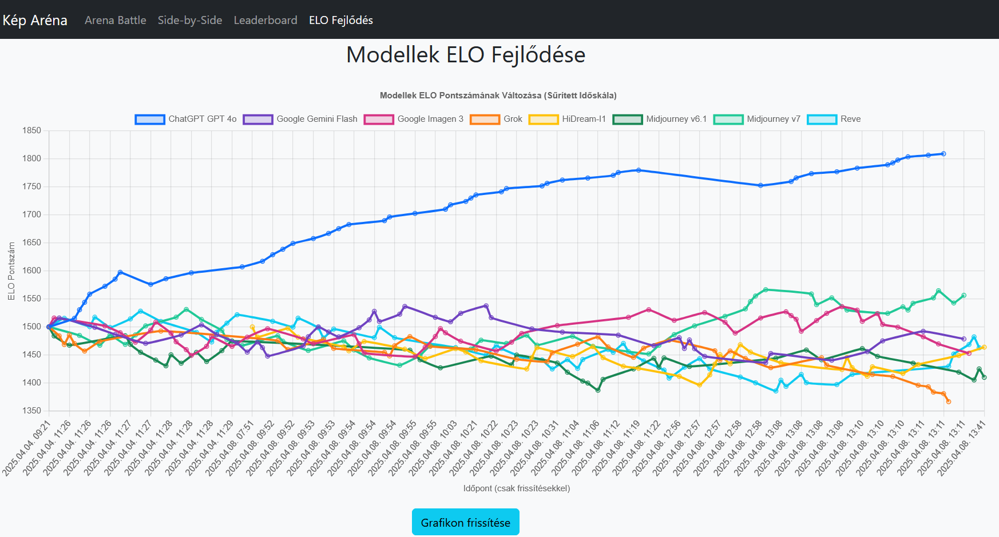

# Képgenerátor Aréna


## 🚀 Áttekintés

A Képgenerátor Aréna egy web-alapú alkalmazás, amely lehetővé teszi különböző AI képgenerátorok által létrehozott képek összehasonlítását és értékelését. A rendszer négy fő módot kínál:

- **Arena Battle:** Két kép közvetlen összehasonlítása, ahol a felhasználók a jobbnak ítélt képre szavazhatnak
- **Side-by-Side:** Két kiválasztott modell képeinek összehasonlítása egymás mellett
- **Leaderboard:** A modellek ranglistája az ELO pontszámok és egyéb statisztikák alapján
- **ELO Fejlődés:** Grafikon, amely az egyes modellek ELO pontszámának időbeli változását mutatja

## ✨ Funkciók

- 🏆 **ELO Rating:** Fejlett pontrendszer, amely figyelembe veszi az ellenfelek erősségét
- 🖼️ **Több formátum támogatása:** JPG, JPEG és PNG
- ⚙️ **Konfigurálhatóság:** Modellek, fájlformátumok és alapbeállítások külön konfigurációs fájlban
- 👁️‍🗨️ **Vak szavazás:** Arena Battle módban a modellek nevei csak a szavazás után jelennek meg
- 📊 **Részletes statisztikák:** ELO pontszámok, győzelmek, mérkőzések száma és győzelmi arányok

## 🛠️ Telepítés

### Követelmények

- Python 3.6+
- pip (Python csomagkezelő)
- Git (opcionális)

### Telepítési lépések

```bash
# 1. Klónozd vagy töltsd le a repository-t
git clone https://github.com/yourusername/image-leaderboard.git
cd image-leaderboard

# 2. Függőségek telepítése
pip install -r requirements.txt

# 3. Adatbázis inicializálása
python database.py

# 4. Alkalmazás indítása
flask run --host=0.0.0.0

# Az alkalmazás alapértelmezetten a következő címen érhető el:
# http://localhost:5000
```

## 📋 Használat

### 1. Arena Battle

Az Arena Battle a rendszer fő módja, ahol két véletlenszerűen kiválasztott modell által generált kép jelenik meg egymás mellett. A felhasználók kiválaszthatják, melyik kép tetszik jobban, vagy döntetlen/kihagyás opciót választhatnak.

A modellek nevei csak a szavazás után jelennek meg, így biztosítva az elfogulatlan értékelést.

### 2. Side-by-Side

A Side-by-Side módban a felhasználók maguk választhatják ki, melyik két modellt szeretnék összehasonlítani. Ez a mód elsősorban vizuális összehasonlításra szolgál, nincs szavazás.

### 3. Leaderboard

A Leaderboard a modellek ranglistáját mutatja ELO pontszám szerint csökkenő sorrendben. A táblázat tartalmazza az ELO értékeket, a győzelmek számát, az összes mérkőzés számát és a győzelmi arányt.

### 4. ELO Fejlődés

Az ELO Fejlődés nézet egy interaktív vonaldiagramot kínál, amely megjeleníti a modellek ELO pontszámának változását az idő múlásával. Ez lehetővé teszi a felhasználók számára, hogy nyomon kövessék, hogyan teljesítenek a modellek hosszabb időtávon.

Főbb jellemzők:
- Minden modellhez külön színezett vonal
- Interaktív információs dobozok a pontos értékek megjelenítésére
- Időalapú x-tengely a fejlődés kronológiai nyomon követéséhez
- Frissítési lehetőség a legfrissebb adatok betöltéséhez



## ⚙️ Parancssori funkciók

### Szavazatok resetelése

```bash
python app.py reset-votes
```

Ez a parancs törli az összes eddigi szavazatot és visszaállítja az ELO pontszámokat az alapértelmezett értékre. Ezt akkor érdemes használni, ha:
- Teljesen új versenyt akarsz indítani
- Tesztadatok után szeretnéd az éles adatgyűjtést elkezdeni
- Problémás szavazatok kerültek a rendszerbe

**Fontos:** A parancs az `elo_history` tábla tartalmát is törli, így a grafikon is tiszta lappal indul újra. Az ELO fejlődés grafikonon minden modell újra az alapértelmezett ELO pontszámról (1500) fog indulni.

## 📁 Rugalmas fájlkezelés

A rendszer képes rugalmasan kezelni a képfájlok kiterjesztéseit. Ez azt jelenti, hogy:

- ✅ Ugyanazon modell képei különböző kiterjesztésekkel szerepelhetnek különböző prompt mappákban
- ✅ Támogatott kiterjesztések: `.jpg`, `.jpeg`, `.png`
- ⚠️ A fájlnév alaprésze (kiterjesztés nélkül) mindig meg kell hogy egyezzen a konfigurációban beállítottal

Példa konfiguráció:
```python
# Modell nevek és a hozzájuk tartozó fájl alapnevek (kiterjesztés nélkül)
MODELS = {
    'Grok': 'grok',
    'Google Gemini Flash': 'gemini-flash',
    'Google Imagen 3': 'imagen3', 
    'ChatGPT GPT 4o': 'gpt4o',
    'Midjourney v6.1': 'midjourneyv61',
    'Midjourney v7': 'midjourneyv7',
    'Reve': 'reve',
    'HiDreamI1': 'hidreami1'
}
```

## 🌟 Jelenleg támogatott modellek

- Grok
- Google Gemini Flash
- Google Imagen 3
- ChatGPT GPT 4o
- Midjourney v6.1
- Midjourney v7
- Reve
- HiDreamI1

## 🗄️ Adatbázis struktúra

A rendszer három fő táblát használ:

1. **votes** - A felhasználói szavazatok tárolására
   ```
   id INTEGER PRIMARY KEY
   prompt_id TEXT
   winner TEXT
   loser TEXT
   voted_at TIMESTAMP
   ```

2. **model_elo** - A modellek aktuális ELO pontszámainak tárolására
   ```
   model TEXT PRIMARY KEY
   elo REAL
   last_updated TIMESTAMP
   ```

3. **elo_history** - Az ELO pontszámok változásának történeti nyomon követésére
   ```
   id INTEGER PRIMARY KEY
   model TEXT
   elo REAL
   timestamp TIMESTAMP
   ```

## 🔌 API végpontok

A rendszer a következő API végpontokat biztosítja:

| Végpont | Metódus | Leírás |
|---------|---------|--------|
| `/api/battle_data` | GET | Véletlenszerűen kiválaszt két modellt és egy promptot, visszaadja a szükséges képek URL-jeit a csatához. |
| `/api/side_by_side_data` | GET | Két megadott modellhez és egy véletlenszerű prompthoz visszaadja a képek URL-jeit. |
| `/api/vote` | POST | Rögzíti a felhasználó szavazatát és frissíti az ELO értékeket. |
| `/api/leaderboard` | GET | Visszaadja az aktuális Leaderboard adatokat (ELO, győzelmek, meccsek, arányok). |
| `/api/elo_history` | GET | Visszaadja az ELO értékek időbeli változásait a modellek grafikonos megjelenítéséhez. |

## 📝 Licenc

[MIT](LICENSE)

## 📚 További dokumentáció

A részletes dokumentáció a `docs/index.html` fájlban található.